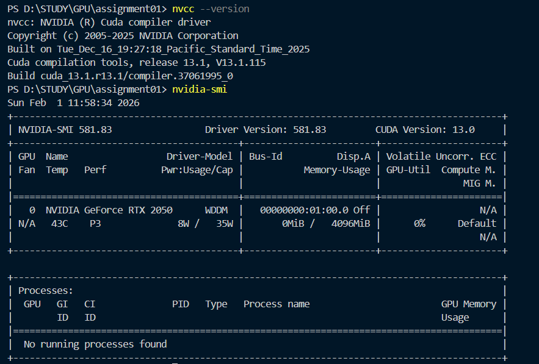

# Task 1: GPU Coding Environment Setup

This document outlines the setup of the GPU programming environment on my local machine to support CUDA-accelerated development.

## 1. System Specifications
* **Laptop Model:** HP Victus
* **Operating System:** Windows 11 Pro
* **GPU:** NVIDIA GeForce RTX 2050

## 2. Software Configuration
* **NVIDIA Driver:** Version 591.86
* **CUDA Toolkit:** Version 13.1.
* **Host Compiler:** Microsoft Visual Studio (MSVC).
* **IDE:** VS Code with NVIDIA Nsight Visual Studio Code Edition extension.

## 3. Installation Steps
1.  **Visual Studio Code:** Installed with the "Desktop development with C++" workload.
2.  **NVIDIA Drivers:** Updated to the latest version.
3.  **CUDA Toolkit 13.1:** Installed the local executive package, which includes `nvcc`.
4.  **VS Code Configuration:** Configured `tasks.json` and `c_cpp_properties.json` to automate the compilation process using `nvcc`.

## 4. Verification of Setup
